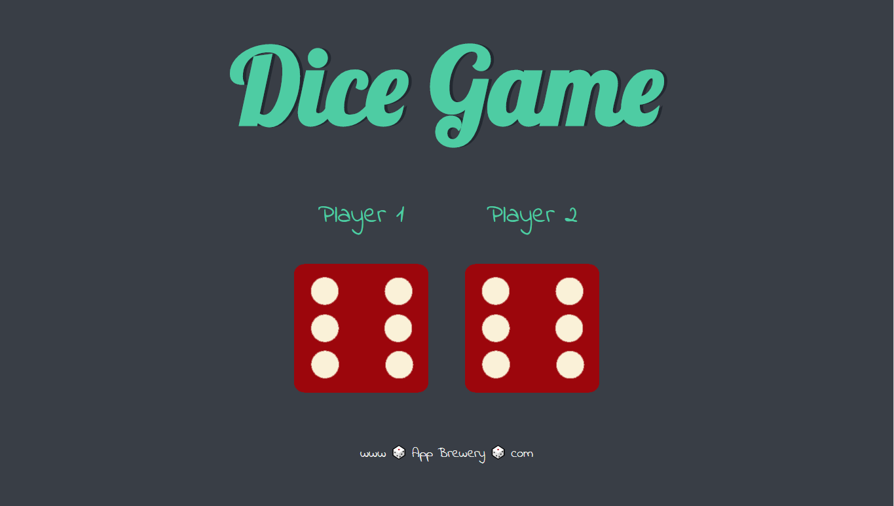
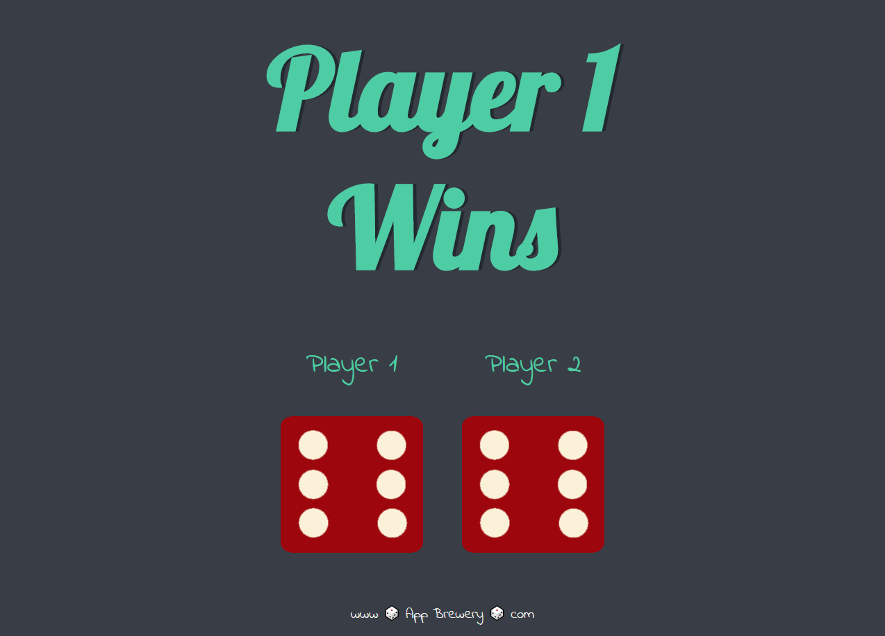
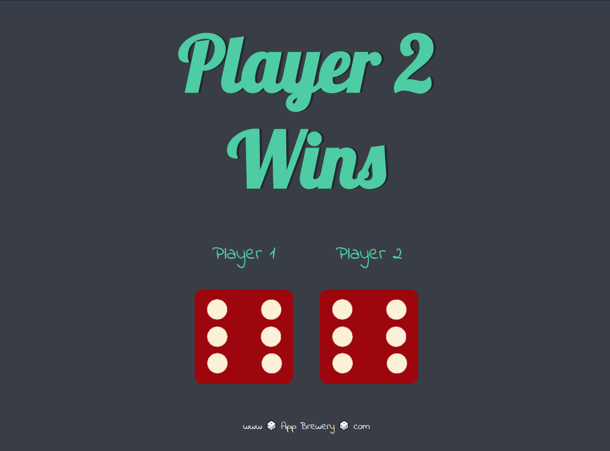
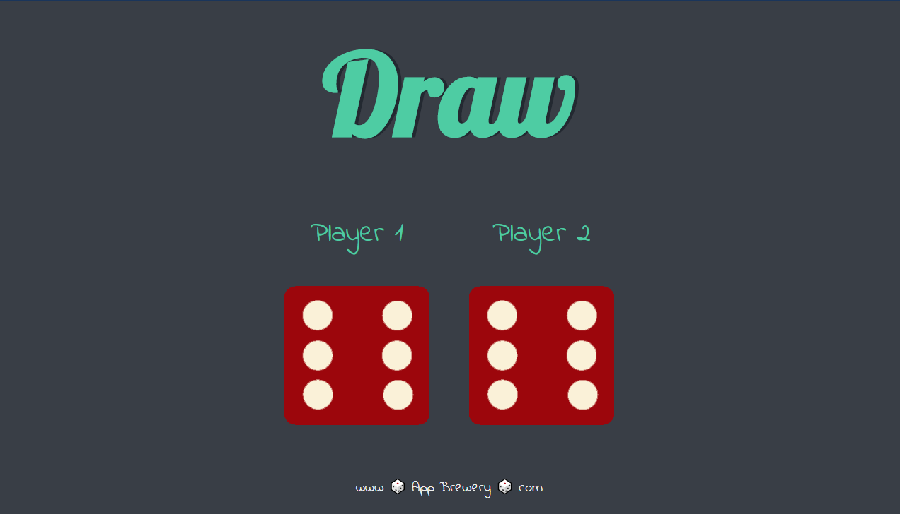

# dicee-game

> Assignment #3 in Full-Stack Web Development Bootcamp 2020 by Dr. Angela Yu
___
### Table of Contents

- [Description](#description)
- [Usage](#usage)
- [Credits](#credits)
___
## Description
This is a simple game that presents the user with two images and upon refresh the dice 'roll' and if 'player one' has a higher value than 'player 2' then the page would change. It would also present the user with a changed title depending on who won the game. Our assignment was to write the majority of the Javascript to accomplish this.

#### Technologies Used:
- HTML
- CSS
- Javascript
- <a href="https://atom.io/">Atom</a>
- <a href="https://fonts.google.com/">google fonts</a>

___

## Usage
This project has no usage other than to present future employers of my progress as a Fullstack Web Developer.
___

## Credits
- Dr. Angela Yu
- Udemy
